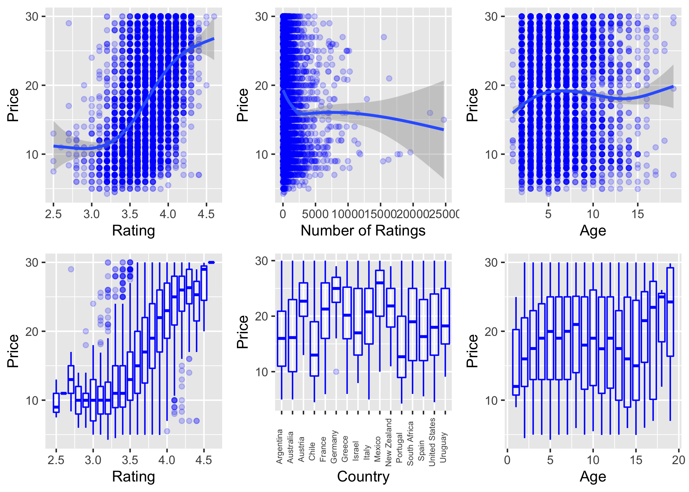
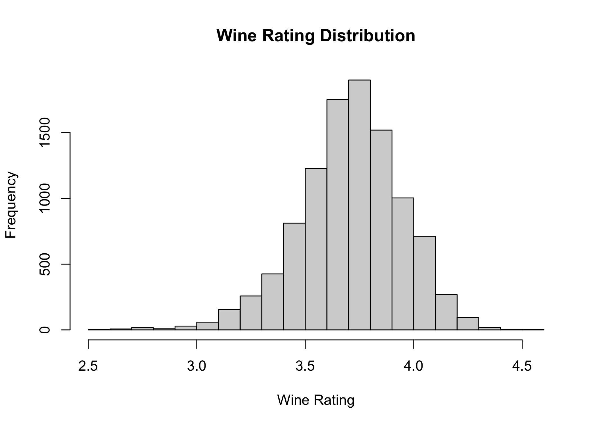
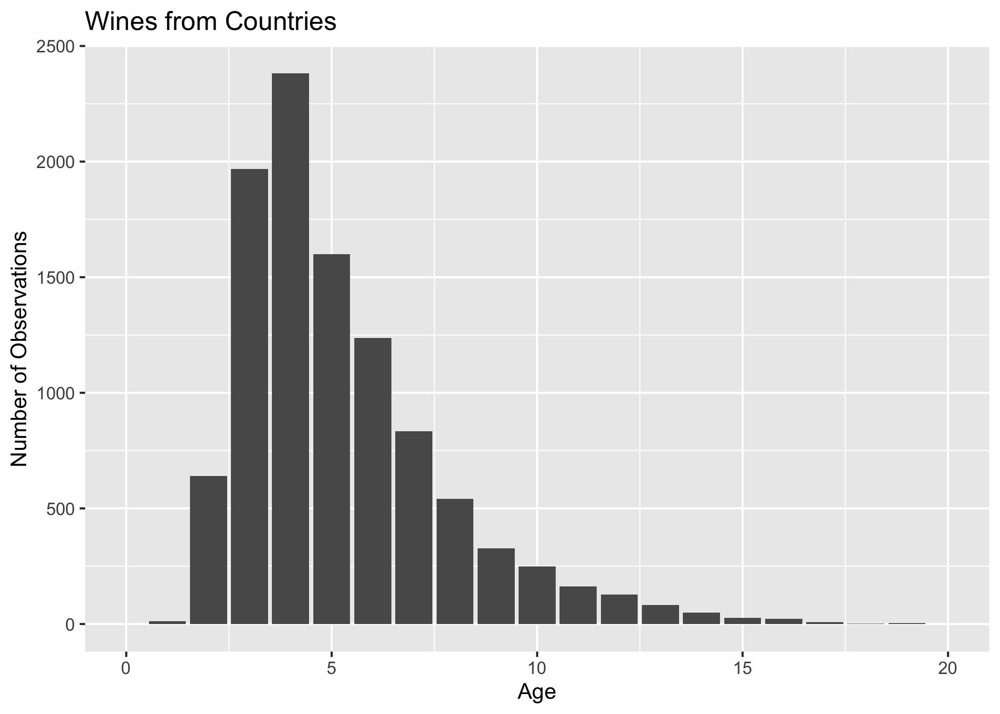
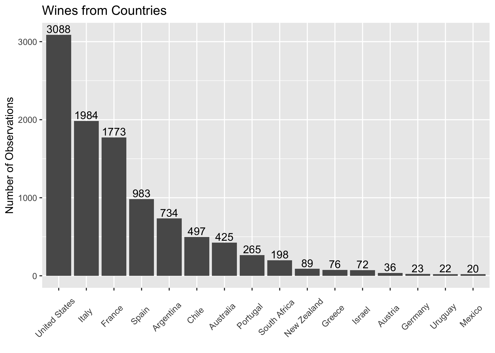
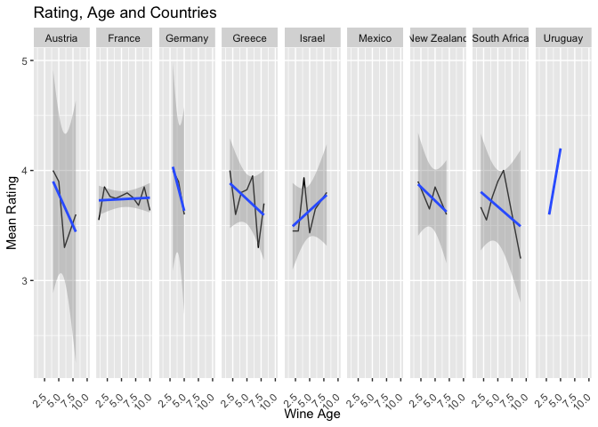
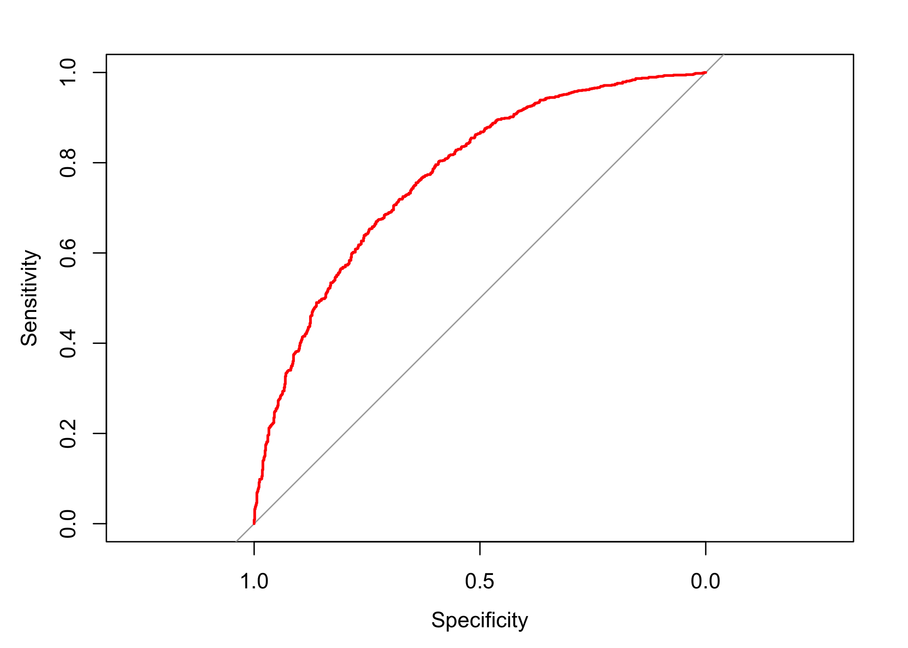
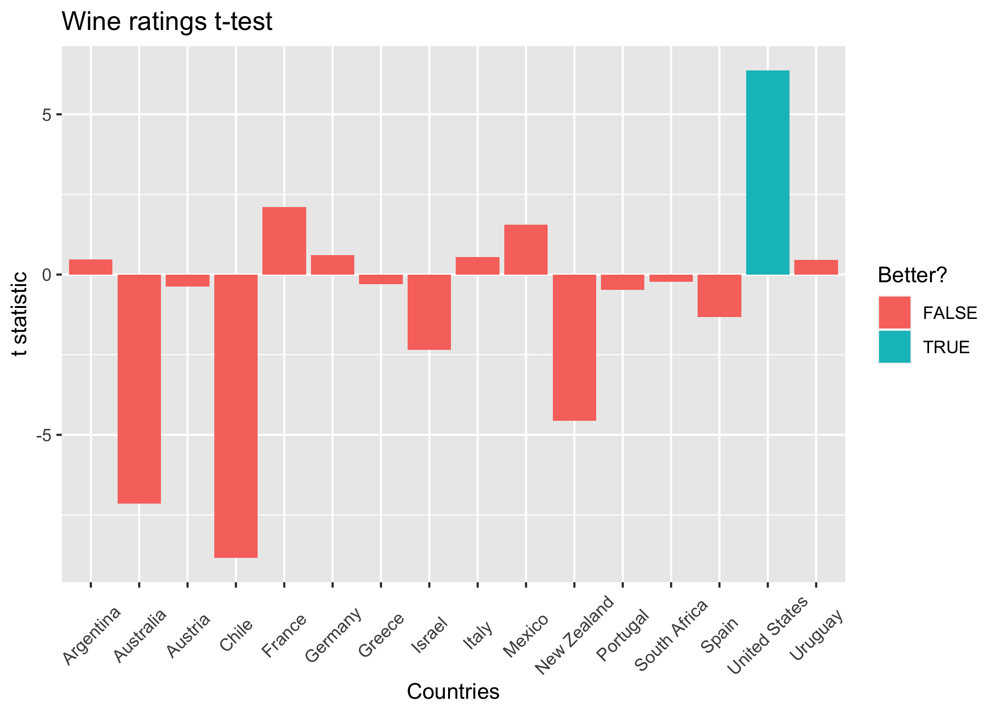

-   [Abstract](#abstract)
-   [Introduction](#introduction)
-   [Data Description](#data-description)
    -   [Vivino Web Scraping](#vivino-web-scraping)
    -   [Cleaning](#cleaning)
    -   [Data Exploration](#data-exploration)
-   [Empirical Models](#empirical-models)
-   [Results and Diagnostics](#results-and-diagnostics)
    -   [Is the wine good?](#is-the-wine-good)
    -   [So which country should I buy?](#so-which-country-should-i-buy)
-   [Conclusion](#conclusion)
-   [References](#references)

## Abstract

Is there a correlation between wine’s price and wine’s signifiers such
as rating, number of ratings, and country? To answer the question,
10,000 data points on wines were web scraped from Vivino. The data was
cleaned and prepared for linear regression. A significant relationship
between the explanatory variables and price was found. Additionally, a
logistic regression on whether the wine’s rating is above the mean wine
rating was conducted. The logistic regression had significant predictive
power. A simple rule of thumb is proposed from the research for buying
wine in California.

## Introduction

Purchasing a bottle of wine is a heavy responsibility. The quality of
the event depends on this small decision. But what if you do not know
anything about wine? Is there a way to make a safe decision? Is more
expensive wine better? I have web scraped over 10,000 red wines in $4 to
$30 price range from Vivino.com to answer these questions. The first
section will contain a description of the data collection process. The
second section will discuss and visualize the data used in the analysis.
The empirical model will be outlined in the third section, followed by a
discussion of results and diagnostics in the fourth. The conclusion will
contain possible future developments and my opinion on the project.

## Data Description

### Vivino Web Scraping

A wine rating is a readily accessible measure of consumer sentiment and
often the only way to suppose if the wine is good. Vivino is an online
wine marketplace with over 12.5 million different wines and an active
community. Wine cards have geographical information such as country,
region and winery as well as information about the number of ratings,
rating, vintage, and price. It must be noted that data were collected in
San Francisco, California, and is specific to this location. Data was
collected using docker, Rselenium, and rvest combination, so every
listing would be exactly what you would find yourself. Each one-dollar
price range (4-30) was scraped individually. For more information on the
web scraping, please, refer to the datasource.r file.

### Cleaning

The resulting dataset contains observations of red wine in the $4 to $30
price range. Wine year was replaced with years old as of the current
year (2022). Countries with less than ten wines were removed. In the
data used for regression, only wines younger than ten years and with
more than 30 reviews were used.

    ##   wine_name         wine_country        wine_rating      n_ratings      
    ##  Length:10285       Length:10285       Min.   :2.500   Min.   :   25.0  
    ##  Class :character   Class :character   1st Qu.:3.600   1st Qu.:   68.0  
    ##  Mode  :character   Mode  :character   Median :3.800   Median :  165.0  
    ##                                        Mean   :3.759   Mean   :  518.5  
    ##                                        3rd Qu.:3.900   3rd Qu.:  464.0  
    ##                                        Max.   :4.600   Max.   :24713.0  
    ##    wine_price        y_old           winery         
    ##  Min.   : 4.25   Min.   : 1.000   Length:10285      
    ##  1st Qu.:12.99   1st Qu.: 3.000   Class :character  
    ##  Median :18.98   Median : 5.000   Mode  :character  
    ##  Mean   :18.58   Mean   : 5.257                     
    ##  3rd Qu.:24.00   3rd Qu.: 6.000                     
    ##  Max.   :30.00   Max.   :38.000

### Data Exploration

The relationship between the wine price and explanatory variables is
summarized in the following graphs. There is an observable correlation
between rating and price. Cheaper wines appear to have more reviews.
There seems to be some relationship between age and price, with older
wines costing more. Countries have different distributions of prices.

The following tables present distributions of explanatory variables.
Wine ratings appear to be normally distributed, which might reflect
Vivino’s recommendation algorithm. Low wine ratings appear to be
prevalent, with a large portion settled before 500 reviews. Most of the
dataset’s wines lay between the 1-5 age range, which can be expected for
the price range. Lastly, products of some countries are more present in
the sample due to the geographic position of the collection or simply
the larger variety produced by the government. The distribution on the
number of ratings appears to follow log distribution, so it will be used
as a log in the regression.

The range of age variable might come from non-available for purchase or
bad stock wines. The following graph examines if age leads to higher
rating for each country. For some countries there is not enough data
points to make a definitive answer. Nonetheless, in most cases wines
younger than 5 years have higher ratings.

## Empirical Models

To estimate the relationships between variables I will be using linear
model. The regression price prediction:
`Price ~ age + age^2 + country + rating + log(number_of_ratings) rating*n_ratings`.
Age and rating are expected to have a positive correlation, while
number\_of\_ratings is suspected of having a negative correlation
because affordable wines have more reviews. The variable country will be
converted into a series of dummy variables, so some countries are
generally expected to have better or worse wine, which will also be
examined using logistic regression.

## Results and Diagnostics

The regression results suggest that age and `wine_rating` positively
correlate with price, while `n_ratings` have negative. Each extra year
increases the price by $1.05. A 1% increase in the number of ratings
coincides with a 8.11% decrease in price. The interaction variable
between `n_ratings` and `wine_rating` suggests that 1 unit increase in
rating increases marginal effect of 1% change of number of ratings on
price by 1.91%. Three of these variables have a significant relationship
at the 1% level. Countries have a variable impact on the price, with
some being better than others. Wald Test on the significance of the
country variable resulted in 352.64, which is enough to accept that the
country variable is significant at 1% significance. Level R2
of the regression is 37.65%, meaning the variability of explanatory
variables explains 37.65% of the price variation. F statistic for the
regression is 282.11, which is enough to confirm that the regression has
substantial explanatory power at 1% significance level. To test for
heteroskedasticity, White Test was used. The test p-value is below 1%,
so we can conclude that the distribution of errors is heteroskedastic.
To test for multicollinearity, VIF is used. All explanatory variables
before introduction of interaction term had VIF less than 1.1, meaning
multicollinearity was not a concern for the model. Nonetheless,
introduction of interaction term reduced intercept and wine country
Chile significance below threshold, which was expected.

<table style="border-collapse:collapse; border:none;">
<tr>
<th style="border-top: double; text-align:center; font-style:normal; font-weight:bold; padding:0.2cm;  text-align:left; ">
 
</th>
<th colspan="3" style="border-top: double; text-align:center; font-style:normal; font-weight:bold; padding:0.2cm; ">
wine\_price
</th>
</tr>
<tr>
<td style=" text-align:center; border-bottom:1px solid; font-style:italic; font-weight:normal;  text-align:left; ">
Predictors
</td>
<td style=" text-align:center; border-bottom:1px solid; font-style:italic; font-weight:normal;  ">
Estimates
</td>
<td style=" text-align:center; border-bottom:1px solid; font-style:italic; font-weight:normal;  ">
CI
</td>
<td style=" text-align:center; border-bottom:1px solid; font-style:italic; font-weight:normal;  ">
p
</td>
</tr>
<tr>
<td style=" padding:0.2cm; text-align:left; vertical-align:top; text-align:left; ">
(Intercept)
</td>
<td style=" padding:0.2cm; text-align:left; vertical-align:top; text-align:center;  ">
-2.66
</td>
<td style=" padding:0.2cm; text-align:left; vertical-align:top; text-align:center;  ">
-9.78 – 4.46
</td>
<td style=" padding:0.2cm; text-align:left; vertical-align:top; text-align:center;  ">
0.464
</td>
</tr>
<tr>
<td style=" padding:0.2cm; text-align:left; vertical-align:top; text-align:left; ">
y old
</td>
<td style=" padding:0.2cm; text-align:left; vertical-align:top; text-align:center;  ">
1.05
</td>
<td style=" padding:0.2cm; text-align:left; vertical-align:top; text-align:center;  ">
0.77 – 1.33
</td>
<td style=" padding:0.2cm; text-align:left; vertical-align:top; text-align:center;  ">
<strong>&lt;0.001</strong>
</td>
</tr>
<tr>
<td style=" padding:0.2cm; text-align:left; vertical-align:top; text-align:left; ">
y old^2
</td>
<td style=" padding:0.2cm; text-align:left; vertical-align:top; text-align:center;  ">
-0.05
</td>
<td style=" padding:0.2cm; text-align:left; vertical-align:top; text-align:center;  ">
-0.08 – -0.03
</td>
<td style=" padding:0.2cm; text-align:left; vertical-align:top; text-align:center;  ">
<strong>&lt;0.001</strong>
</td>
</tr>
<tr>
<td style=" padding:0.2cm; text-align:left; vertical-align:top; text-align:left; ">
wine country \[Australia\]
</td>
<td style=" padding:0.2cm; text-align:left; vertical-align:top; text-align:center;  ">
1.29
</td>
<td style=" padding:0.2cm; text-align:left; vertical-align:top; text-align:center;  ">
0.63 – 1.96
</td>
<td style=" padding:0.2cm; text-align:left; vertical-align:top; text-align:center;  ">
<strong>&lt;0.001</strong>
</td>
</tr>
<tr>
<td style=" padding:0.2cm; text-align:left; vertical-align:top; text-align:left; ">
wine country \[Austria\]
</td>
<td style=" padding:0.2cm; text-align:left; vertical-align:top; text-align:center;  ">
5.22
</td>
<td style=" padding:0.2cm; text-align:left; vertical-align:top; text-align:center;  ">
3.44 – 6.99
</td>
<td style=" padding:0.2cm; text-align:left; vertical-align:top; text-align:center;  ">
<strong>&lt;0.001</strong>
</td>
</tr>
<tr>
<td style=" padding:0.2cm; text-align:left; vertical-align:top; text-align:left; ">
wine country \[Chile\]
</td>
<td style=" padding:0.2cm; text-align:left; vertical-align:top; text-align:center;  ">
-0.35
</td>
<td style=" padding:0.2cm; text-align:left; vertical-align:top; text-align:center;  ">
-0.98 – 0.28
</td>
<td style=" padding:0.2cm; text-align:left; vertical-align:top; text-align:center;  ">
0.280
</td>
</tr>
<tr>
<td style=" padding:0.2cm; text-align:left; vertical-align:top; text-align:left; ">
wine country \[France\]
</td>
<td style=" padding:0.2cm; text-align:left; vertical-align:top; text-align:center;  ">
3.21
</td>
<td style=" padding:0.2cm; text-align:left; vertical-align:top; text-align:center;  ">
2.73 – 3.69
</td>
<td style=" padding:0.2cm; text-align:left; vertical-align:top; text-align:center;  ">
<strong>&lt;0.001</strong>
</td>
</tr>
<tr>
<td style=" padding:0.2cm; text-align:left; vertical-align:top; text-align:left; ">
wine country \[Germany\]
</td>
<td style=" padding:0.2cm; text-align:left; vertical-align:top; text-align:center;  ">
5.92
</td>
<td style=" padding:0.2cm; text-align:left; vertical-align:top; text-align:center;  ">
3.57 – 8.27
</td>
<td style=" padding:0.2cm; text-align:left; vertical-align:top; text-align:center;  ">
<strong>&lt;0.001</strong>
</td>
</tr>
<tr>
<td style=" padding:0.2cm; text-align:left; vertical-align:top; text-align:left; ">
wine country \[Greece\]
</td>
<td style=" padding:0.2cm; text-align:left; vertical-align:top; text-align:center;  ">
2.72
</td>
<td style=" padding:0.2cm; text-align:left; vertical-align:top; text-align:center;  ">
1.38 – 4.06
</td>
<td style=" padding:0.2cm; text-align:left; vertical-align:top; text-align:center;  ">
<strong>&lt;0.001</strong>
</td>
</tr>
<tr>
<td style=" padding:0.2cm; text-align:left; vertical-align:top; text-align:left; ">
wine country \[Israel\]
</td>
<td style=" padding:0.2cm; text-align:left; vertical-align:top; text-align:center;  ">
1.91
</td>
<td style=" padding:0.2cm; text-align:left; vertical-align:top; text-align:center;  ">
0.58 – 3.24
</td>
<td style=" padding:0.2cm; text-align:left; vertical-align:top; text-align:center;  ">
<strong>0.005</strong>
</td>
</tr>
<tr>
<td style=" padding:0.2cm; text-align:left; vertical-align:top; text-align:left; ">
wine country \[Italy\]
</td>
<td style=" padding:0.2cm; text-align:left; vertical-align:top; text-align:center;  ">
2.86
</td>
<td style=" padding:0.2cm; text-align:left; vertical-align:top; text-align:center;  ">
2.40 – 3.33
</td>
<td style=" padding:0.2cm; text-align:left; vertical-align:top; text-align:center;  ">
<strong>&lt;0.001</strong>
</td>
</tr>
<tr>
<td style=" padding:0.2cm; text-align:left; vertical-align:top; text-align:left; ">
wine country \[Mexico\]
</td>
<td style=" padding:0.2cm; text-align:left; vertical-align:top; text-align:center;  ">
5.52
</td>
<td style=" padding:0.2cm; text-align:left; vertical-align:top; text-align:center;  ">
3.17 – 7.87
</td>
<td style=" padding:0.2cm; text-align:left; vertical-align:top; text-align:center;  ">
<strong>&lt;0.001</strong>
</td>
</tr>
<tr>
<td style=" padding:0.2cm; text-align:left; vertical-align:top; text-align:left; ">
wine country \[New Zealand\]
</td>
<td style=" padding:0.2cm; text-align:left; vertical-align:top; text-align:center;  ">
6.25
</td>
<td style=" padding:0.2cm; text-align:left; vertical-align:top; text-align:center;  ">
5.04 – 7.46
</td>
<td style=" padding:0.2cm; text-align:left; vertical-align:top; text-align:center;  ">
<strong>&lt;0.001</strong>
</td>
</tr>
<tr>
<td style=" padding:0.2cm; text-align:left; vertical-align:top; text-align:left; ">
wine country \[Portugal\]
</td>
<td style=" padding:0.2cm; text-align:left; vertical-align:top; text-align:center;  ">
-1.78
</td>
<td style=" padding:0.2cm; text-align:left; vertical-align:top; text-align:center;  ">
-2.54 – -1.01
</td>
<td style=" padding:0.2cm; text-align:left; vertical-align:top; text-align:center;  ">
<strong>&lt;0.001</strong>
</td>
</tr>
<tr>
<td style=" padding:0.2cm; text-align:left; vertical-align:top; text-align:left; ">
wine country \[South Africa\]
</td>
<td style=" padding:0.2cm; text-align:left; vertical-align:top; text-align:center;  ">
1.58
</td>
<td style=" padding:0.2cm; text-align:left; vertical-align:top; text-align:center;  ">
0.72 – 2.43
</td>
<td style=" padding:0.2cm; text-align:left; vertical-align:top; text-align:center;  ">
<strong>&lt;0.001</strong>
</td>
</tr>
<tr>
<td style=" padding:0.2cm; text-align:left; vertical-align:top; text-align:left; ">
wine country \[Spain\]
</td>
<td style=" padding:0.2cm; text-align:left; vertical-align:top; text-align:center;  ">
0.44
</td>
<td style=" padding:0.2cm; text-align:left; vertical-align:top; text-align:center;  ">
-0.09 – 0.97
</td>
<td style=" padding:0.2cm; text-align:left; vertical-align:top; text-align:center;  ">
0.105
</td>
</tr>
<tr>
<td style=" padding:0.2cm; text-align:left; vertical-align:top; text-align:left; ">
wine country \[United States\]
</td>
<td style=" padding:0.2cm; text-align:left; vertical-align:top; text-align:center;  ">
0.80
</td>
<td style=" padding:0.2cm; text-align:left; vertical-align:top; text-align:center;  ">
0.35 – 1.24
</td>
<td style=" padding:0.2cm; text-align:left; vertical-align:top; text-align:center;  ">
<strong>&lt;0.001</strong>
</td>
</tr>
<tr>
<td style=" padding:0.2cm; text-align:left; vertical-align:top; text-align:left; ">
wine country \[Uruguay\]
</td>
<td style=" padding:0.2cm; text-align:left; vertical-align:top; text-align:center;  ">
2.27
</td>
<td style=" padding:0.2cm; text-align:left; vertical-align:top; text-align:center;  ">
-0.02 – 4.56
</td>
<td style=" padding:0.2cm; text-align:left; vertical-align:top; text-align:center;  ">
0.052
</td>
</tr>
<tr>
<td style=" padding:0.2cm; text-align:left; vertical-align:top; text-align:left; ">
n ratings \[log\]
</td>
<td style=" padding:0.2cm; text-align:left; vertical-align:top; text-align:center;  ">
-8.11
</td>
<td style=" padding:0.2cm; text-align:left; vertical-align:top; text-align:center;  ">
-9.45 – -6.77
</td>
<td style=" padding:0.2cm; text-align:left; vertical-align:top; text-align:center;  ">
<strong>&lt;0.001</strong>
</td>
</tr>
<tr>
<td style=" padding:0.2cm; text-align:left; vertical-align:top; text-align:left; ">
wine rating
</td>
<td style=" padding:0.2cm; text-align:left; vertical-align:top; text-align:center;  ">
5.55
</td>
<td style=" padding:0.2cm; text-align:left; vertical-align:top; text-align:center;  ">
3.67 – 7.42
</td>
<td style=" padding:0.2cm; text-align:left; vertical-align:top; text-align:center;  ">
<strong>&lt;0.001</strong>
</td>
</tr>
<tr>
<td style=" padding:0.2cm; text-align:left; vertical-align:top; text-align:left; ">
n ratings \[log\] \* wine rating
</td>
<td style=" padding:0.2cm; text-align:left; vertical-align:top; text-align:center;  ">
1.91
</td>
<td style=" padding:0.2cm; text-align:left; vertical-align:top; text-align:center;  ">
1.56 – 2.26
</td>
<td style=" padding:0.2cm; text-align:left; vertical-align:top; text-align:center;  ">
<strong>&lt;0.001</strong>
</td>
</tr>
<tr>
<td style=" padding:0.2cm; text-align:left; vertical-align:top; text-align:left; padding-top:0.1cm; padding-bottom:0.1cm; border-top:1px solid;">
Observations
</td>
<td style=" padding:0.2cm; text-align:left; vertical-align:top; padding-top:0.1cm; padding-bottom:0.1cm; text-align:left; border-top:1px solid;" colspan="3">
9365
</td>
</tr>
<tr>
<td style=" padding:0.2cm; text-align:left; vertical-align:top; text-align:left; padding-top:0.1cm; padding-bottom:0.1cm;">
R2 / R2 adjusted
</td>
<td style=" padding:0.2cm; text-align:left; vertical-align:top; padding-top:0.1cm; padding-bottom:0.1cm; text-align:left;" colspan="3">
0.376 / 0.375
</td>
</tr>
</table>

    ## [1] "Wald test statistic: 352.64"

    ## 
    ##  studentized Breusch-Pagan test
    ## 
    ## data:  lm_price_model
    ## BP = 444.36, df = 130, p-value < 2.2e-16

    ##                                  GVIF Df GVIF^(1/(2*Df))
    ## y_old                       25.284233  1        5.028343
    ## I(y_old^2)                  25.173723  1        5.017342
    ## wine_country                 1.111022 15        1.003516
    ## log(n_ratings)             255.205102  1       15.975140
    ## wine_rating                 16.814468  1        4.100545
    ## log(n_ratings):wine_rating 280.916366  1       16.760560

To address the heteroskedasticity a robust regression was performed. The
t-statistics were not significantly different from the original OLS
regression, so we can conclude heteroskedasticity is not a major
concern.

<table>
<thead>
<tr class="header">
<th style="text-align: left;">coefficients</th>
<th style="text-align: right;">Robust</th>
<th style="text-align: right;">OLS</th>
</tr>
</thead>
<tbody>
<tr class="odd">
<td style="text-align: left;">(Intercept)</td>
<td style="text-align: right;">-0.785</td>
<td style="text-align: right;">-0.732</td>
</tr>
<tr class="even">
<td style="text-align: left;">y_old</td>
<td style="text-align: right;">7.240</td>
<td style="text-align: right;">7.432</td>
</tr>
<tr class="odd">
<td style="text-align: left;">I(y_old^2)</td>
<td style="text-align: right;">-4.031</td>
<td style="text-align: right;">-4.184</td>
</tr>
<tr class="even">
<td style="text-align: left;">wine_countryAustralia</td>
<td style="text-align: right;">3.878</td>
<td style="text-align: right;">3.838</td>
</tr>
<tr class="odd">
<td style="text-align: left;">wine_countryAustria</td>
<td style="text-align: right;">6.433</td>
<td style="text-align: right;">5.768</td>
</tr>
<tr class="even">
<td style="text-align: left;">wine_countryChile</td>
<td style="text-align: right;">-1.234</td>
<td style="text-align: right;">-1.081</td>
</tr>
<tr class="odd">
<td style="text-align: left;">wine_countryFrance</td>
<td style="text-align: right;">13.970</td>
<td style="text-align: right;">13.064</td>
</tr>
<tr class="even">
<td style="text-align: left;">wine_countryGermany</td>
<td style="text-align: right;">5.507</td>
<td style="text-align: right;">4.941</td>
</tr>
<tr class="odd">
<td style="text-align: left;">wine_countryGreece</td>
<td style="text-align: right;">3.541</td>
<td style="text-align: right;">3.987</td>
</tr>
<tr class="even">
<td style="text-align: left;">wine_countryIsrael</td>
<td style="text-align: right;">2.997</td>
<td style="text-align: right;">2.808</td>
</tr>
<tr class="odd">
<td style="text-align: left;">wine_countryItaly</td>
<td style="text-align: right;">12.554</td>
<td style="text-align: right;">11.973</td>
</tr>
<tr class="even">
<td style="text-align: left;">wine_countryMexico</td>
<td style="text-align: right;">5.974</td>
<td style="text-align: right;">4.605</td>
</tr>
<tr class="odd">
<td style="text-align: left;">wine_countryNew Zealand</td>
<td style="text-align: right;">12.865</td>
<td style="text-align: right;">10.099</td>
</tr>
<tr class="even">
<td style="text-align: left;">wine_countryPortugal</td>
<td style="text-align: right;">-4.496</td>
<td style="text-align: right;">-4.554</td>
</tr>
<tr class="odd">
<td style="text-align: left;">wine_countrySouth Africa</td>
<td style="text-align: right;">3.755</td>
<td style="text-align: right;">3.604</td>
</tr>
<tr class="even">
<td style="text-align: left;">wine_countrySpain</td>
<td style="text-align: right;">1.682</td>
<td style="text-align: right;">1.621</td>
</tr>
<tr class="odd">
<td style="text-align: left;">wine_countryUnited States</td>
<td style="text-align: right;">3.794</td>
<td style="text-align: right;">3.493</td>
</tr>
<tr class="even">
<td style="text-align: left;">wine_countryUruguay</td>
<td style="text-align: right;">2.314</td>
<td style="text-align: right;">1.940</td>
</tr>
<tr class="odd">
<td style="text-align: left;">log(n_ratings)</td>
<td style="text-align: right;">-13.091</td>
<td style="text-align: right;">-11.877</td>
</tr>
<tr class="even">
<td style="text-align: left;">wine_rating</td>
<td style="text-align: right;">6.191</td>
<td style="text-align: right;">5.795</td>
</tr>
<tr class="odd">
<td style="text-align: left;">log(n_ratings):wine_rating</td>
<td style="text-align: right;">11.648</td>
<td style="text-align: right;">10.587</td>
</tr>
</tbody>
</table>

### Is the wine good?

Another question is, would it possible to guess whether a wine is good?
Let us divide wines into bad, below mean rating, and good, above mean
rating. Logistic regression was run using price, age, and number of
ratings to answer the question. The data was partitioned into 80% train
and 20% test data. The resulting regression
`good ~ y_old + y_old^2 + wine_country + log(n_ratings) + wine_price`
found that at 1% significance level there is negative correlation with
age and positive correlation with log of number of ratings and price.
Only a few countries pass the 5% significance level. Nonetheless, the
Wald Test statistic of 420.92 suggests that the variable country is
significant to be included in the regression. The R2 is
23.6%, meaning 23.6% of the deviance in good/bad is explained by
variance of explanatory variables. F statistic is 420.92, which is
enough to confirm that the regression has substantial explanatory power
at a 1% significance level. The area under the ROC curve is 78.1%,
indicating that the model can distinguish between good and bad wines.

<table style="border-collapse:collapse; border:none;">
<tr>
<th style="border-top: double; text-align:center; font-style:normal; font-weight:bold; padding:0.2cm;  text-align:left; ">
 
</th>
<th colspan="3" style="border-top: double; text-align:center; font-style:normal; font-weight:bold; padding:0.2cm; ">
good
</th>
</tr>
<tr>
<td style=" text-align:center; border-bottom:1px solid; font-style:italic; font-weight:normal;  text-align:left; ">
Predictors
</td>
<td style=" text-align:center; border-bottom:1px solid; font-style:italic; font-weight:normal;  ">
Odds Ratios
</td>
<td style=" text-align:center; border-bottom:1px solid; font-style:italic; font-weight:normal;  ">
CI
</td>
<td style=" text-align:center; border-bottom:1px solid; font-style:italic; font-weight:normal;  ">
p
</td>
</tr>
<tr>
<td style=" padding:0.2cm; text-align:left; vertical-align:top; text-align:left; ">
(Intercept)
</td>
<td style=" padding:0.2cm; text-align:left; vertical-align:top; text-align:center;  ">
0.03
</td>
<td style=" padding:0.2cm; text-align:left; vertical-align:top; text-align:center;  ">
0.02 – 0.04
</td>
<td style=" padding:0.2cm; text-align:left; vertical-align:top; text-align:center;  ">
<strong>&lt;0.001</strong>
</td>
</tr>
<tr>
<td style=" padding:0.2cm; text-align:left; vertical-align:top; text-align:left; ">
y old
</td>
<td style=" padding:0.2cm; text-align:left; vertical-align:top; text-align:center;  ">
0.88
</td>
<td style=" padding:0.2cm; text-align:left; vertical-align:top; text-align:center;  ">
0.85 – 0.90
</td>
<td style=" padding:0.2cm; text-align:left; vertical-align:top; text-align:center;  ">
<strong>&lt;0.001</strong>
</td>
</tr>
<tr>
<td style=" padding:0.2cm; text-align:left; vertical-align:top; text-align:left; ">
wine country \[Australia\]
</td>
<td style=" padding:0.2cm; text-align:left; vertical-align:top; text-align:center;  ">
0.52
</td>
<td style=" padding:0.2cm; text-align:left; vertical-align:top; text-align:center;  ">
0.38 – 0.71
</td>
<td style=" padding:0.2cm; text-align:left; vertical-align:top; text-align:center;  ">
<strong>&lt;0.001</strong>
</td>
</tr>
<tr>
<td style=" padding:0.2cm; text-align:left; vertical-align:top; text-align:left; ">
wine country \[Austria\]
</td>
<td style=" padding:0.2cm; text-align:left; vertical-align:top; text-align:center;  ">
0.33
</td>
<td style=" padding:0.2cm; text-align:left; vertical-align:top; text-align:center;  ">
0.13 – 0.82
</td>
<td style=" padding:0.2cm; text-align:left; vertical-align:top; text-align:center;  ">
<strong>0.017</strong>
</td>
</tr>
<tr>
<td style=" padding:0.2cm; text-align:left; vertical-align:top; text-align:left; ">
wine country \[Chile\]
</td>
<td style=" padding:0.2cm; text-align:left; vertical-align:top; text-align:center;  ">
0.75
</td>
<td style=" padding:0.2cm; text-align:left; vertical-align:top; text-align:center;  ">
0.56 – 1.01
</td>
<td style=" padding:0.2cm; text-align:left; vertical-align:top; text-align:center;  ">
0.063
</td>
</tr>
<tr>
<td style=" padding:0.2cm; text-align:left; vertical-align:top; text-align:left; ">
wine country \[France\]
</td>
<td style=" padding:0.2cm; text-align:left; vertical-align:top; text-align:center;  ">
0.77
</td>
<td style=" padding:0.2cm; text-align:left; vertical-align:top; text-align:center;  ">
0.61 – 0.96
</td>
<td style=" padding:0.2cm; text-align:left; vertical-align:top; text-align:center;  ">
<strong>0.022</strong>
</td>
</tr>
<tr>
<td style=" padding:0.2cm; text-align:left; vertical-align:top; text-align:left; ">
wine country \[Germany\]
</td>
<td style=" padding:0.2cm; text-align:left; vertical-align:top; text-align:center;  ">
0.67
</td>
<td style=" padding:0.2cm; text-align:left; vertical-align:top; text-align:center;  ">
0.23 – 2.22
</td>
<td style=" padding:0.2cm; text-align:left; vertical-align:top; text-align:center;  ">
0.481
</td>
</tr>
<tr>
<td style=" padding:0.2cm; text-align:left; vertical-align:top; text-align:left; ">
wine country \[Greece\]
</td>
<td style=" padding:0.2cm; text-align:left; vertical-align:top; text-align:center;  ">
0.80
</td>
<td style=" padding:0.2cm; text-align:left; vertical-align:top; text-align:center;  ">
0.42 – 1.54
</td>
<td style=" padding:0.2cm; text-align:left; vertical-align:top; text-align:center;  ">
0.502
</td>
</tr>
<tr>
<td style=" padding:0.2cm; text-align:left; vertical-align:top; text-align:left; ">
wine country \[Israel\]
</td>
<td style=" padding:0.2cm; text-align:left; vertical-align:top; text-align:center;  ">
0.78
</td>
<td style=" padding:0.2cm; text-align:left; vertical-align:top; text-align:center;  ">
0.41 – 1.47
</td>
<td style=" padding:0.2cm; text-align:left; vertical-align:top; text-align:center;  ">
0.444
</td>
</tr>
<tr>
<td style=" padding:0.2cm; text-align:left; vertical-align:top; text-align:left; ">
wine country \[Italy\]
</td>
<td style=" padding:0.2cm; text-align:left; vertical-align:top; text-align:center;  ">
0.72
</td>
<td style=" padding:0.2cm; text-align:left; vertical-align:top; text-align:center;  ">
0.58 – 0.90
</td>
<td style=" padding:0.2cm; text-align:left; vertical-align:top; text-align:center;  ">
<strong>0.004</strong>
</td>
</tr>
<tr>
<td style=" padding:0.2cm; text-align:left; vertical-align:top; text-align:left; ">
wine country \[Mexico\]
</td>
<td style=" padding:0.2cm; text-align:left; vertical-align:top; text-align:center;  ">
0.62
</td>
<td style=" padding:0.2cm; text-align:left; vertical-align:top; text-align:center;  ">
0.21 – 1.96
</td>
<td style=" padding:0.2cm; text-align:left; vertical-align:top; text-align:center;  ">
0.386
</td>
</tr>
<tr>
<td style=" padding:0.2cm; text-align:left; vertical-align:top; text-align:left; ">
wine country \[New Zealand\]
</td>
<td style=" padding:0.2cm; text-align:left; vertical-align:top; text-align:center;  ">
0.16
</td>
<td style=" padding:0.2cm; text-align:left; vertical-align:top; text-align:center;  ">
0.09 – 0.28
</td>
<td style=" padding:0.2cm; text-align:left; vertical-align:top; text-align:center;  ">
<strong>&lt;0.001</strong>
</td>
</tr>
<tr>
<td style=" padding:0.2cm; text-align:left; vertical-align:top; text-align:left; ">
wine country \[Portugal\]
</td>
<td style=" padding:0.2cm; text-align:left; vertical-align:top; text-align:center;  ">
1.56
</td>
<td style=" padding:0.2cm; text-align:left; vertical-align:top; text-align:center;  ">
1.08 – 2.26
</td>
<td style=" padding:0.2cm; text-align:left; vertical-align:top; text-align:center;  ">
<strong>0.017</strong>
</td>
</tr>
<tr>
<td style=" padding:0.2cm; text-align:left; vertical-align:top; text-align:left; ">
wine country \[South Africa\]
</td>
<td style=" padding:0.2cm; text-align:left; vertical-align:top; text-align:center;  ">
1.05
</td>
<td style=" padding:0.2cm; text-align:left; vertical-align:top; text-align:center;  ">
0.69 – 1.62
</td>
<td style=" padding:0.2cm; text-align:left; vertical-align:top; text-align:center;  ">
0.809
</td>
</tr>
<tr>
<td style=" padding:0.2cm; text-align:left; vertical-align:top; text-align:left; ">
wine country \[Spain\]
</td>
<td style=" padding:0.2cm; text-align:left; vertical-align:top; text-align:center;  ">
0.97
</td>
<td style=" padding:0.2cm; text-align:left; vertical-align:top; text-align:center;  ">
0.76 – 1.25
</td>
<td style=" padding:0.2cm; text-align:left; vertical-align:top; text-align:center;  ">
0.838
</td>
</tr>
<tr>
<td style=" padding:0.2cm; text-align:left; vertical-align:top; text-align:left; ">
wine country \[United States\]
</td>
<td style=" padding:0.2cm; text-align:left; vertical-align:top; text-align:center;  ">
1.28
</td>
<td style=" padding:0.2cm; text-align:left; vertical-align:top; text-align:center;  ">
1.04 – 1.58
</td>
<td style=" padding:0.2cm; text-align:left; vertical-align:top; text-align:center;  ">
<strong>0.021</strong>
</td>
</tr>
<tr>
<td style=" padding:0.2cm; text-align:left; vertical-align:top; text-align:left; ">
wine country \[Uruguay\]
</td>
<td style=" padding:0.2cm; text-align:left; vertical-align:top; text-align:center;  ">
1.18
</td>
<td style=" padding:0.2cm; text-align:left; vertical-align:top; text-align:center;  ">
0.42 – 3.49
</td>
<td style=" padding:0.2cm; text-align:left; vertical-align:top; text-align:center;  ">
0.758
</td>
</tr>
<tr>
<td style=" padding:0.2cm; text-align:left; vertical-align:top; text-align:left; ">
n ratings \[log\]
</td>
<td style=" padding:0.2cm; text-align:left; vertical-align:top; text-align:center;  ">
1.28
</td>
<td style=" padding:0.2cm; text-align:left; vertical-align:top; text-align:center;  ">
1.23 – 1.34
</td>
<td style=" padding:0.2cm; text-align:left; vertical-align:top; text-align:center;  ">
<strong>&lt;0.001</strong>
</td>
</tr>
<tr>
<td style=" padding:0.2cm; text-align:left; vertical-align:top; text-align:left; ">
wine price
</td>
<td style=" padding:0.2cm; text-align:left; vertical-align:top; text-align:center;  ">
1.19
</td>
<td style=" padding:0.2cm; text-align:left; vertical-align:top; text-align:center;  ">
1.18 – 1.20
</td>
<td style=" padding:0.2cm; text-align:left; vertical-align:top; text-align:center;  ">
<strong>&lt;0.001</strong>
</td>
</tr>
<tr>
<td style=" padding:0.2cm; text-align:left; vertical-align:top; text-align:left; padding-top:0.1cm; padding-bottom:0.1cm; border-top:1px solid;">
Observations
</td>
<td style=" padding:0.2cm; text-align:left; vertical-align:top; padding-top:0.1cm; padding-bottom:0.1cm; text-align:left; border-top:1px solid;" colspan="3">
7492
</td>
</tr>
<tr>
<td style=" padding:0.2cm; text-align:left; vertical-align:top; text-align:left; padding-top:0.1cm; padding-bottom:0.1cm;">
R2 Tjur
</td>
<td style=" padding:0.2cm; text-align:left; vertical-align:top; padding-top:0.1cm; padding-bottom:0.1cm; text-align:left;" colspan="3">
0.235
</td>
</tr>
</table>

    ## [1] "Wald test statistic: 414.09"

    ## Area under the curve: 0.772

### So which country should I buy?

If you live in California, according to the t-test results, wines made
in the U.S. have a significantly better rating on Vivino.

## Conclusion

Searching for a good bottle of wine is not easy and might feel like
rolling a dice. Luckily, there appears to be some correlation between
ratings, prices, and countries. While it is impossible to make a 100%
accurate prediction, devising a rule of thumb can be reasonable. If you
live in California look for the U.S.-made wines and try to buy the most
expensive you can reasonably afford, or download Vivino and check the
reviews before buying.

There is a more efficient way to web scrape data from Vivino using their
API. So, if someone wants to reproduce data collection, I would
recommend going this route rather than the one I elected. Additionally,
future development would involve incorporating weather data for the
regions of the wines.

## References
