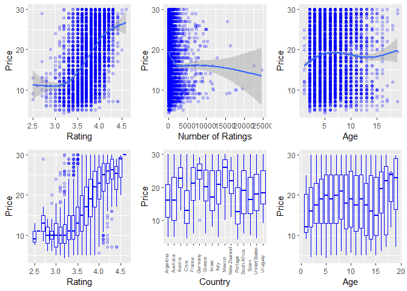
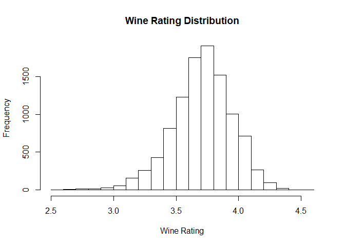
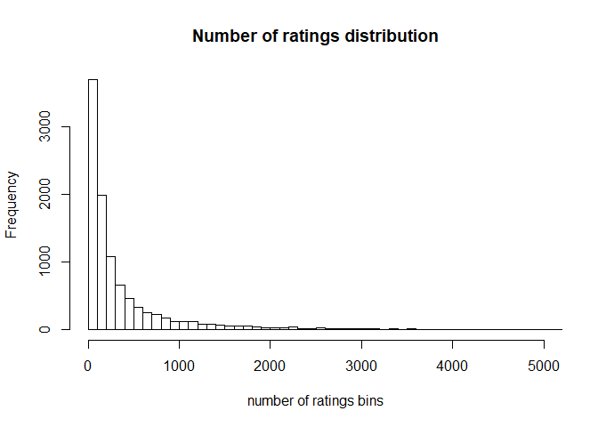
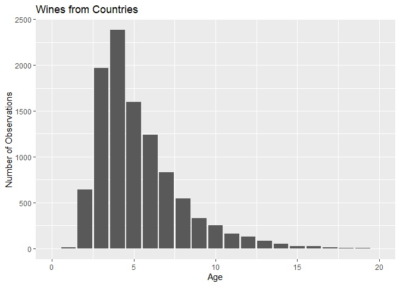
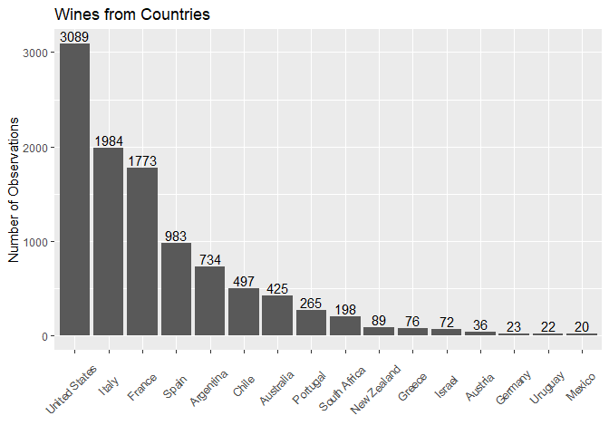
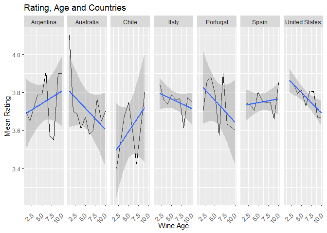
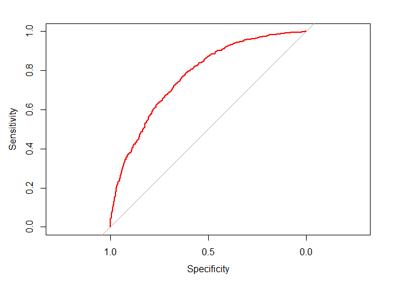
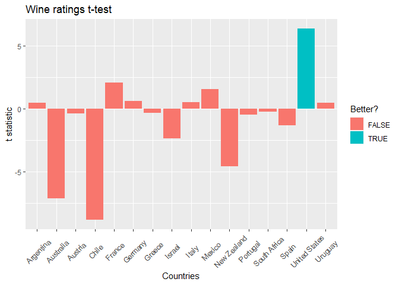

## Abstract

Is there a correlation between wine’s price and wine’s signifiers such
as rating, number of ratings, and country? To answer the question,
10,000 data points on wines were web scraped from Vivino. The data was
cleaned and prepared for linear regression. A significant relationship
between the explanatory variables and price was found. Additionally, a
logistic regression on whether the wine’s rating is above the mean wine
rating was conducted. The logistic regression had significant predictive
power. A simple rule of thumb is proposed from the research for buying
wine in California.

## Introduction

Purchasing a bottle of wine is a heavy responsibility. The quality of
the event depends on this small decision. But what if you do not know
anything about wine? Is there a way to make a safe decision? Is more
expensive wine better? I have web scraped over 10,000 red wines in $4 to
$30 price range from Vivino.com to answer these questions. The first
section will contain a description of the data collection process. The
second section will discuss and visualize the data used in the analysis.
The empirical model will be outlined in the third section, followed by a
discussion of results and diagnostics in the fourth. The conclusion will
contain possible future developments and my opinion on the project.

## Data Description

### Vivino Web Scraping

A wine rating is a readily accessible measure of consumer sentiment and
often the only way to suppose if the wine is good. Vivino is an online
wine marketplace with over 12.5 million different wines and an active
community. Wine cards have geographical information such as country,
region and winery as well as information about the number of ratings,
rating, vintage, and price. It must be noted that data were collected in
San Francisco, California, and is specific to this location. Data was
collected using docker, Rselenium, and rvest combination, so every
listing would be exactly what you would find yourself. Each one-dollar
price range (4-30) was scraped individually. For more information on the
web scraping, please, refer to the [source.Rms](source.Rmd) file. To download the data go to [https://www.kaggle.com/nikitatkachenko/VivinoRedWine](https://www.kaggle.com/nikitatkachenko/VivinoRedWine).

### Cleaning

The resulting dataset contains 10,000 observations of red wine in the $4
to $30 price range. Wine year was replaced with years old as of the
current year (2022). Countries with less than ten wines were removed. In
the data used for regression, only wines younger than ten years and with
more than 30 reviews were used.

    ##               wine_name           wine_country   wine_rating   
    ##  Cabernet Sauvignon: 770   United States:3089   Min.   :2.500  
    ##  Pinot Noir        : 561   Italy        :1984   1st Qu.:3.600  
    ##  Merlot            : 290   France       :1773   Median :3.800  
    ##  Malbec            : 142   Spain        : 983   Mean   :3.759  
    ##  Red Blend         : 102   Argentina    : 734   3rd Qu.:3.900  
    ##  Zinfandel         :  93   Chile        : 497   Max.   :4.600  
    ##  (Other)           :8328   (Other)      :1226                  
    ##    n_ratings         wine_price        y_old       
    ##  Min.   :   25.0   Min.   : 4.25   Min.   : 1.000  
    ##  1st Qu.:   68.0   1st Qu.:12.99   1st Qu.: 3.000  
    ##  Median :  165.0   Median :18.98   Median : 5.000  
    ##  Mean   :  518.5   Mean   :18.58   Mean   : 5.257  
    ##  3rd Qu.:  464.0   3rd Qu.:24.00   3rd Qu.: 6.000  
    ##  Max.   :24713.0   Max.   :30.00   Max.   :38.000  
    ##                                                    
    ##                          winery     
    ##  Francis Ford Coppola Winery:   38  
    ##  Santa Rita                 :   29  
    ##  Yellow Tail                :   27  
    ##  19 Crimes                  :   26  
    ##  Beringer                   :   25  
    ##  Bogle                      :   24  
    ##  (Other)                    :10117

### Data Exploration

The relationship between the wine price and explanatory variables is
summarized in the following graphs. There is an observable correlation
between rating and price. Cheaper wines appear to have more reviews.
There seems to be some relationship between age and price, with older
wines costing more. Countries have different distributions of prices.

The following tables present distributions of explanatory variables.
Wine ratings appear to be normally distributed, which might reflect
Vivino’s recommendation algorithm. Low wine ratings appear to be
prevalent, with a large portion settled before 500 reviews. Most of the
dataset’s wines lay between the 1-5 age range, which can be expected for
the price range. Lastly, products of some countries are more present in
the sample due to the geographic position of the collection or simply
the larger variety produced by the government. The distribution on the
number of ratings appears to follow log distribution, so it will be used
as a log in the regression.

The range of age variable might come from non-available for purchase or
bad stock wines. The following graph examines if age leads to higher
rating for each country. For some countries there is not enough data
points to make a definitive answer. Nonetheless, in most cases wines
younger than 5 years have higher ratings.

## Empirical Models

To estimate the relationships between variables I will be using linear
model. The regression price prediction: Price ~ age + age^2 + country +
rating + log(number\_of\_ratings). Age and rating are expected to have a
positive correlation, while number\_of\_ratings is suspected of having a
negative correlation because affordable wines have more reviews. The
variable country will be converted into a series of dummy variables, so
some countries are generally expected to have better or worse wine,
which will also be examined using logistic regression.

## Results and Diagnostics

The regression results suggest that age and wine\_rating positively
correlate with price, while n\_ratings have negative. Each extra year
increases the price by $0.38. A 1% increase in the number of ratings
coincides with a 1% decrease in price. Three of these variables have a
significant relationship at the 1% level. Countries have a variable
impact on the price, with some being better than others. Wald Test on
the significance of the country variable resulted in 343.18, which is
enough to accept that the country variable is significant at 1%
significance. Level R^2 of the regression is 36.67%, meaning the
variability of explanatory variables explains 36.67% of the price
variation. F statistic for the regression is 305.7, which is enough to
confirm that the regression has substantial explanatory power at 1%
significance level. To test for heteroskedasticity, White Test was used.
The test p-value is below 1%, so we can conclude that the distribution
of errors is not heteroskedastic. To test for multicollinearity, VIF is
used. All explanatory variables have VIF less than 1.1, meaning
multicollinearity is not a concern for the model.

    ## 
    ## Call:
    ## lm(formula = wine_price ~ y_old + y_old^2 + wine_country + log(n_ratings) + 
    ##     wine_rating, data = wines_price_lm)
    ## 
    ## Residuals:
    ##      Min       1Q   Median       3Q      Max 
    ## -19.9070  -3.8152  -0.0999   3.8537  16.8623 
    ## 
    ## Coefficients:
    ##                            Estimate Std. Error t value Pr(>|t|)    
    ## (Intercept)               -38.58036    0.95377 -40.450  < 2e-16 ***
    ## y_old                       0.46570    0.02881  16.164  < 2e-16 ***
    ## wine_countryAustralia       1.16268    0.33895   3.430 0.000606 ***
    ## wine_countryAustria         5.19163    0.91077   5.700 1.23e-08 ***
    ## wine_countryChile          -0.55590    0.32269  -1.723 0.084973 .  
    ## wine_countryFrance          3.10400    0.24660  12.587  < 2e-16 ***
    ## wine_countryGermany         5.91506    1.20704   4.900 9.72e-07 ***
    ## wine_countryGreece          2.69725    0.68748   3.923 8.79e-05 ***
    ## wine_countryIsrael          2.05461    0.68376   3.005 0.002664 ** 
    ## wine_countryItaly           2.85839    0.24057  11.882  < 2e-16 ***
    ## wine_countryMexico          5.48882    1.20688   4.548 5.49e-06 ***
    ## wine_countryNew Zealand     6.06129    0.62295   9.730  < 2e-16 ***
    ## wine_countryPortugal       -1.82989    0.39233  -4.664 3.14e-06 ***
    ## wine_countrySouth Africa    1.57284    0.44019   3.573 0.000355 ***
    ## wine_countrySpain           0.46724    0.27164   1.720 0.085447 .  
    ## wine_countryUnited States   0.78480    0.22884   3.429 0.000607 ***
    ## wine_countryUruguay         2.41600    1.17797   2.051 0.040296 *  
    ## log(n_ratings)             -0.88066    0.04485 -19.635  < 2e-16 ***
    ## wine_rating                15.43478    0.23990  64.338  < 2e-16 ***
    ## ---
    ## Signif. codes:  0 '***' 0.001 '**' 0.01 '*' 0.05 '.' 0.1 ' ' 1
    ## 
    ## Residual standard error: 5.317 on 9347 degrees of freedom
    ## Multiple R-squared:  0.3677, Adjusted R-squared:  0.3665 
    ## F-statistic:   302 on 18 and 9347 DF,  p-value: < 2.2e-16

    ## [1] "Wald test statistic: 339.71"

    ## 
    ##  studentized Breusch-Pagan test
    ## 
    ## data:  lm_price_model
    ## BP = 411.62, df = 130, p-value < 2.2e-16

    ##                    GVIF Df GVIF^(1/(2*Df))
    ## y_old          1.036063  1        1.017872
    ## wine_country   1.092788 15        1.002962
    ## log(n_ratings) 1.085963  1        1.042096
    ## wine_rating    1.041542  1        1.020560

### Is the wine good?

Another question is, would it possible to guess whether a wine is good?
Let us divide wines into bad, below mean rating, and good, above mean
rating. Logistic regression was run using price, age, and number of
ratings to answer the question. The data was partitioned into 80% train
and 20% test data. The resulting regression found that at 1%
significance level there is negative correlation with age and positive
correlation with log of number of ratings and price. Only a few
countries pass the 5% significance level. Nonetheless, the Wald Test
statistic of 420.92 suggests that the variable country is significant to
be included in the regression. The R^2 is 23.13%, meaning 23.13% of the
variability in good/bad is explained by variance of explanatory
variables. F statistic is 420.92, which is enough to confirm that the
regression has substantial explanatory power at a 1% significance level.
The area under the ROC curve is 78.1%, indicating that the model can
distinguish between good and bad wines.

    ## 
    ## Call:
    ## lm(formula = good ~ y_old + y_old^2 + wine_country + log(n_ratings) + 
    ##     wine_price, data = train, family = "binomial")
    ## 
    ## Residuals:
    ##      Min       1Q   Median       3Q      Max 
    ## -1.02144 -0.37003  0.06577  0.35648  1.07855 
    ## 
    ## Coefficients:
    ##                             Estimate Std. Error t value Pr(>|t|)    
    ## (Intercept)               -0.2481809  0.0346094  -7.171 8.16e-13 ***
    ## y_old                     -0.0250750  0.0026412  -9.494  < 2e-16 ***
    ## wine_countryAustralia     -0.1065209  0.0305998  -3.481 0.000502 ***
    ## wine_countryAustria       -0.1717539  0.0822421  -2.088 0.036796 *  
    ## wine_countryChile         -0.0604144  0.0295359  -2.045 0.040845 *  
    ## wine_countryFrance        -0.0484862  0.0229020  -2.117 0.034283 *  
    ## wine_countryGermany       -0.1334961  0.1049561  -1.272 0.203440    
    ## wine_countryGreece        -0.0679265  0.0673176  -1.009 0.312986    
    ## wine_countryIsrael        -0.0735353  0.0642654  -1.144 0.252559    
    ## wine_countryItaly         -0.0681744  0.0222535  -3.064 0.002195 ** 
    ## wine_countryMexico        -0.1361006  0.1110613  -1.225 0.220443    
    ## wine_countryNew Zealand   -0.3785017  0.0550218  -6.879 6.51e-12 ***
    ## wine_countryPortugal       0.0685766  0.0363926   1.884 0.059556 .  
    ## wine_countrySouth Africa   0.0107453  0.0405730   0.265 0.791141    
    ## wine_countrySpain         -0.0096139  0.0248957  -0.386 0.699385    
    ## wine_countryUnited States  0.0443233  0.0210890   2.102 0.035611 *  
    ## wine_countryUruguay        0.0312353  0.1108775   0.282 0.778174    
    ## log(n_ratings)             0.0491626  0.0041182  11.938  < 2e-16 ***
    ## wine_price                 0.0359239  0.0007931  45.297  < 2e-16 ***
    ## ---
    ## Signif. codes:  0 '***' 0.001 '**' 0.01 '*' 0.05 '.' 0.1 ' ' 1
    ## 
    ## Residual standard error: 0.437 on 7473 degrees of freedom
    ## Multiple R-squared:  0.2332, Adjusted R-squared:  0.2313 
    ## F-statistic: 126.2 on 18 and 7473 DF,  p-value: < 2.2e-16

    ## [1] "Wald test statistic: 414.22"

    ## Area under the curve: 0.7699

### So which country should I buy?

If you live in California, according to the t-test results, wines made
in the U.S. have a significantly better rating on Vivino.

## Conclusion

Searching for a good bottle of wine is not easy and might feel like
rolling a dice. Luckily, there appears to be some correlation between
ratings, prices, and countries. While it is impossible to make a 100%
accurate prediction, devising a rule of thumb can be reasonable. If you
live in California look for the U.S.-made wines and try to buy the most
expensive you can reasonably afford, or download Vivino and check the
reviews before buying.

There is a more efficient way to web scrape data from Vivino using their
API. So, if someone wants to reproduce data collection, I would
recommend going this route rather than the one I elected. Additionally,
future development would involve incorporating weather data for the
regions of the wines.

## References
